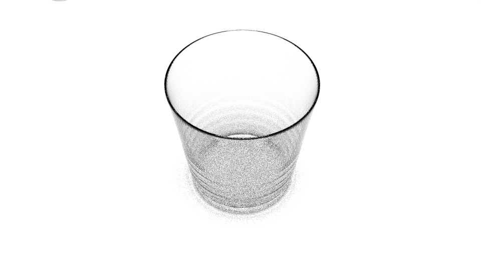
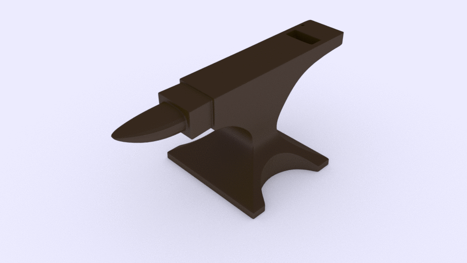
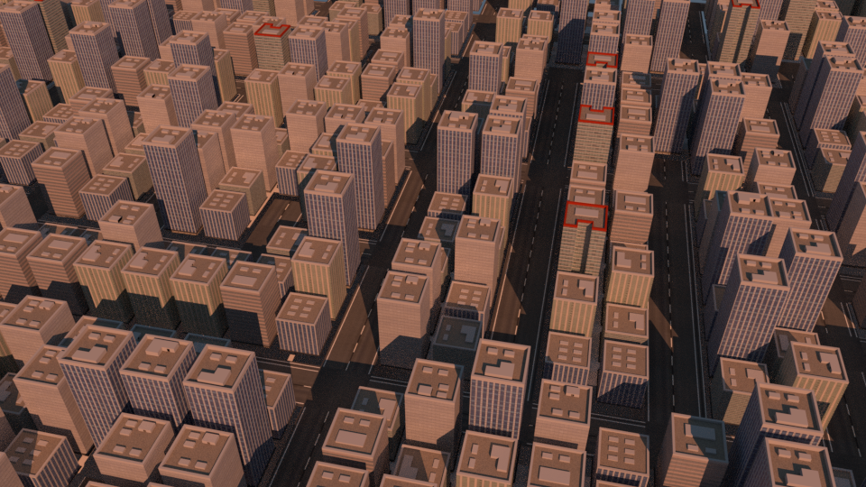

## CGI Basics

So I think cgi is pretty interesting and a cool, useful and powerful way of expression.  Therefore I have followed some tutorials on youtube to learn to use blender.  This repo is for keeping track of the different things Ive made

## Glass

Followed the tutorial on making a glass with fluid physics simulation on [youtube](https://www.youtube.com/watch?v=YgwKPP2ZEjI). Results:

## Anvil

Followed the series of basics tutorials on [youtube](https://www.youtube.com/watch?v=yi87Dap_WOc) by Andrew Price. Results:

## City

Followed the tutorial for creating a city scene in blender on [youtube](https://www.youtube.com/watch?v=XCEN0qQOsIA&t=1587s) again by Blender Guru. Results:

